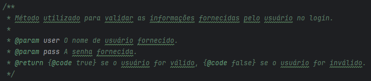
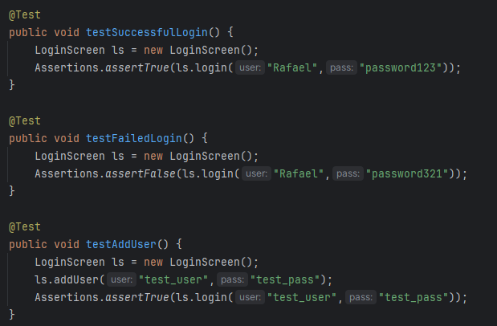

# Exercício individual - Tela de Login TDD

## Descrição
O projeto foi desenvolvido na IDE IntelliJ, consiste em um código simples para colocar em prova o conhecimento em testes de software, realizando testes jUnit, elaborando toda a documentação utilizando os processos de TDD e exportando o JavaDoc.

## Exemplo de Documentação

## Testes

## Documentação

<a href="https://external.ink?to=/JavaDoc/LoginScreen.html">JavaDoc</a>

## Publicação
https://github.com/Rafael-MJ/TQS-LoginScreen

## Última atualização 07/11/23
